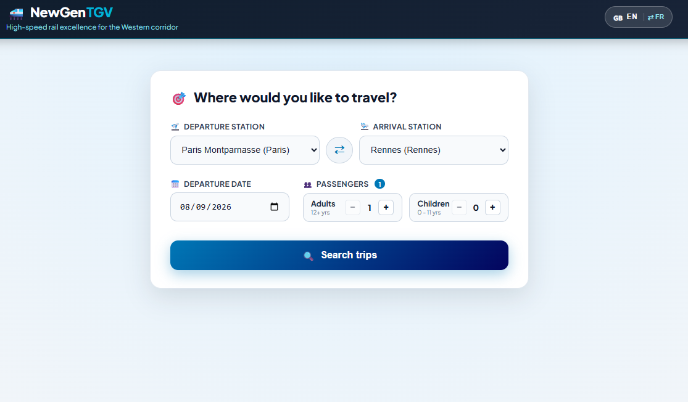
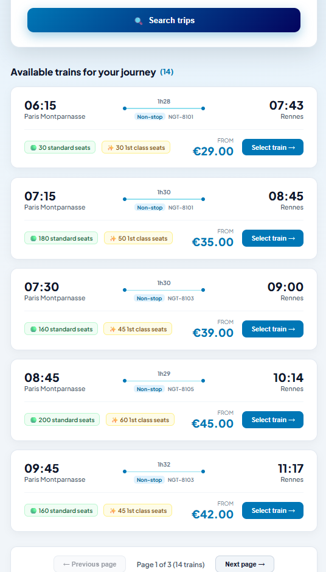
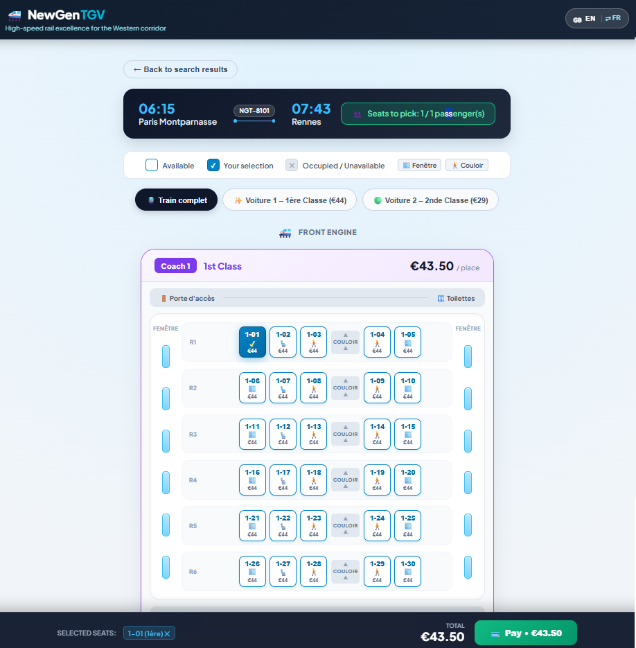
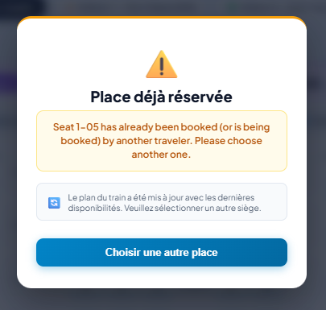
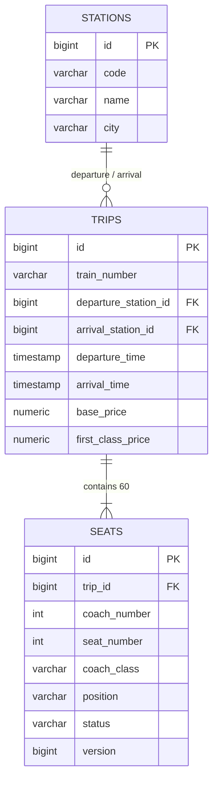

# 🚄 NewGen TGV

Just a POC of a high-speed train (TGV) booking application featuring interactive seat map selection and strict concurrency control during payment.

---

## 🎯 What the Application Does (Features)

1. **Trip Search:** Fast route lookup between train stations with departure time and passenger count filters.
   <!-- Search screenshot placeholder -->
   

2. **Paginated Trips View:** Browse search results with a paginated view, displaying journey times, train numbers, seat availability, prices, and page navigation controls.
   <!-- Paginated trips view screenshot placeholder -->
   

3. **Interactive Train Seat Map:** Realistic carriage layout visualization (1st & 2nd class, aisle, window seats) with interactive seat selection.
   <!-- Seat selection screenshot placeholder -->
   

4. **Payment Simulation & Concurrency:** Real-time temporary seat locking during payment, with immediate conflict resolution if another traveler claims the seat first.
   <!-- Payment / conflict screenshot placeholder -->
   

---

## 🛠️ Tech Stack

- **Frontend:** Angular 21 (Standalone Components, TypeScript, Nginx)
- **Backend:** Spring Boot 3 (Java 21, Spring Data JPA, OpenAPI 3)
- **Database:** PostgreSQL 16

---

## ⚙️ Backend & API Architecture

### 1. OpenAPI Service Contract
- Interactive API documentation powered by Swagger UI at `/swagger-ui/index.html`.
- Strict contract definition conforming to the **OpenAPI 3** specification.
- Clean, strongly-typed response DTOs returned to the frontend (`TripResponse`, `SeatMapResponse`, etc.).

### 2. Standardized Error Format (RFC 7807)
All API errors adhere to the **RFC 7807 (Problem Details)** standard with machine-readable `errorCode` values for client-side localization (i18n):

```json
{
  "type": "https://api.newgentgv.com/errors/seat_already_reserved",
  "title": "Seat Conflict",
  "status": 409,
  "errorCode": "error.business.seat_already_reserved",
  "detail": "Seat 1-05 has already been booked by another traveler.",
  "params": { "seats": "1-05" },
  "unavailableSeats": [
    { "id": 105, "seatCode": "1-05", "status": "LOCKED" }
  ]
}
```

### 3. Typed Validation (422 / 400) & Frontend Highlighting
For invalid requests, the API returns a structured `invalidParams` array. This enables frontend developers to **highlight invalid input fields in red** and show specific validation messages:

```json
{
  "status": 422,
  "title": "Validation Error",
  "invalidParams": [
    { "field": "departureStation", "message": "Departure station cannot be empty" },
    { "field": "passengers", "message": "Passengers count must be greater than 0" }
  ]
}
```

### 4. API Error Codes Summary

| HTTP Status | Type | Description |
| :--- | :--- | :--- |
| **`400 Bad Request`** | Invalid Format | Missing URL parameter or invalid type. |
| **`404 Not Found`** | Resource Missing | Trip (`tripId`) or seat not found. |
| **`409 Conflict`** | Business Conflict | Seat already booked or currently locked by another user. |
| **`422 Unprocessable`** | Business Rule / Validation | Validation failed with detailed invalid fields (`invalidParams`). |
| **`500 Server Error`** | Internal Error | Unexpected server error. |

### 5. Concurrency Control (Locking)
> **Optimistic locking (`@Version`) & Temporary Hold (3s)**:  
> During checkout, seats instantly transition to a `LOCKED` state, preventing concurrent duplicate reservations on the same seat.

---

## 🗄️ Simplified Database Schema



---

## 🚀 Quick Start (Docker)

```bash
# Clone and spin up all containers
docker compose up --build -d
```

- **Frontend:** `http://localhost:4000`
- **Backend API:** `http://localhost:8080/api/v1`
- **Swagger UI:** `http://localhost:4000/swagger-ui/index.html`